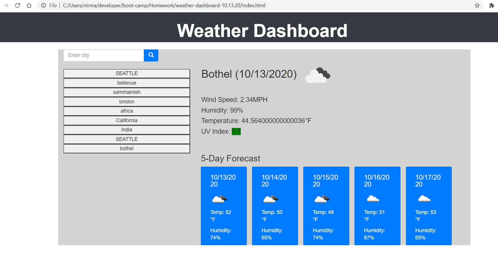

# weather-dashboard-10.13.20

---

## About The Project

---

Implemented the code for weather dashboard application.
Once user open the application,the application will act as below:

-    If user first time visits application, will not see list of cities
     display below the search input box,user will see only input box to enter city name and search button.
-    If click submit button without entering city name,warning
     message will be displayed in red color.
-    If user is existing user(already visited Weather dashboard application),
     then user will able to see her/his searched cities in list(citynames) and
     the page will displays the weather details of last visited city until
     enter new city name and click submit button.

-    This application diplays current weather and five day forecast of perticular
     city selected by user.
-    Current weather details will be retrived thru openweather.com api passing city as parameter.
-    UV index of perticulr city will find by passing longitude and latitude as
     a parameters in Openweather api URL.
-    Five day forecast will be retrieved by passing city name as parameter in Openweather forecast api URL.

## script.js

-    Implemented the following functionalities
-    renderCities: if user is existing user then previously visited cities will
     be displayed
-    getWeather: get weather of current city by passing name as a prarmeter
-    getUVIndex: get UVIndex of current city by passing longitude and latitude as
     a parameter
-    getFiveDayForecast: to get fiveday forecast by passing city name as parameter in Openweather forecast api url.

## index.html

-    Implemented the code for Weather Dashboard using Bootstrap grid system

## css

-    added different varieties of styles to html pages using css selectors
-    used id,classes and tag as selectors

## Built With

-    javascript
-    JQuery
-    html
-    css

## Tools Used

-    Open Weather's Weather and 5 Day Forecast API
-    Bootstrap
-    Moment.js

## Challenges

-    It was very big challenge to display five day forecast,
     it was displaying object type of data instead of string type,
     then used card component of Bootstrap to dynamically create elements and append the text context to the elements and append the element to div in html to display forecast details.

## Getting Started

To get a local copy up and running follow below steps.

## Prerequisites

None

## Installation

Clone the repo
git clone git@github.com:NirmalaAbothu/weather-dashboard-10.13.20.git

## Credits

Followed the documentation of https://www.w3schools.com/ and Bootstrap for jquery and grid system.Moment.js for time and other google documents

## License & copyright

Copyright © 2020 Nirmala Abothu

## Deployed project link

[weather-dashboard](https://nirmalaabothu.github.io/weather-dashboard-10.13.20/)
